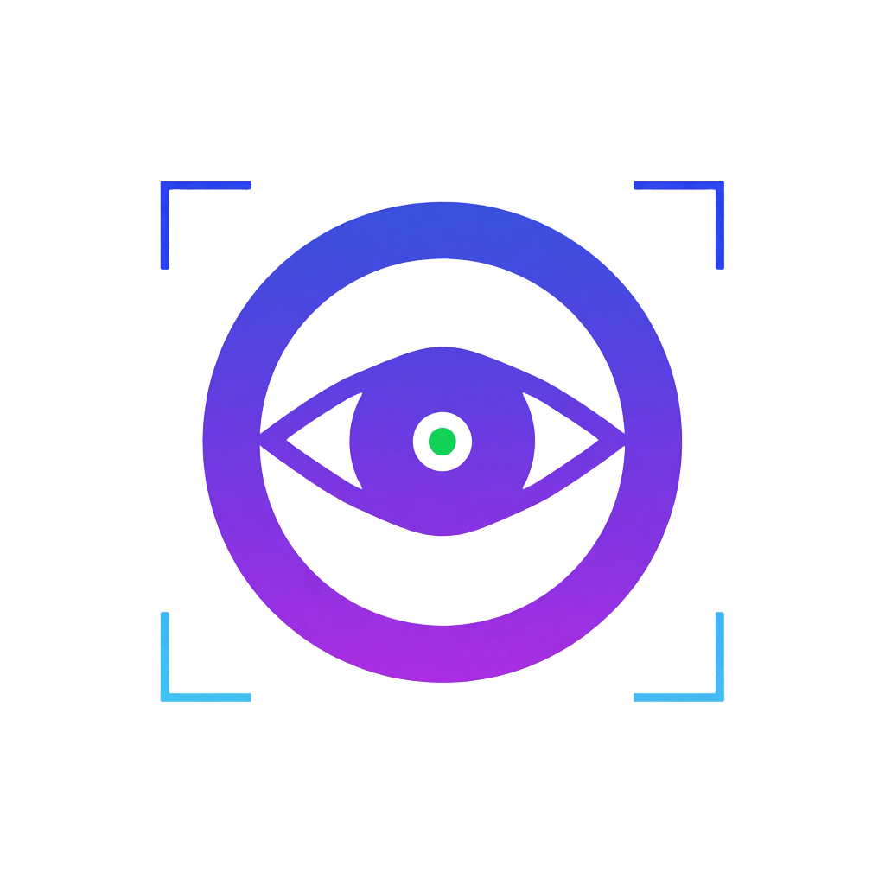

# LabNexus - Portfolio Website

A modern, responsive portfolio website showcasing projects, skills, and professional experience. Built with React, TypeScript, and Tailwind CSS.



## 🌟 Features

- **Responsive Design** - Fully responsive layout that works seamlessly on all devices
- **Interactive UI** - Smooth animations and transitions using Framer Motion
- **Project Showcase** - Filterable project gallery with detailed case studies
- **Skills Section** - Comprehensive display of technical skills and expertise
- **Contact Form** - Functional contact form for inquiries
- **Accessibility** - Built with accessibility best practices (A11y)
- **Performance Optimized** - Fast loading times with Vite and optimized assets

## 🚀 Tech Stack

- **Frontend Framework:** React 19
- **Language:** TypeScript
- **Styling:** Tailwind CSS 4
- **Animations:** Framer Motion
- **Icons:** Lucide React
- **Build Tool:** Vite 7
- **Linting:** ESLint 9

## 📦 Installation

1. Clone the repository:

```bash
git clone https://github.com/OttimonieS/LabNexus.git
cd LabNexus
```

2. Install dependencies:

```bash
npm install
```

3. Start the development server:

```bash
npm run dev
```

4. Open your browser and navigate to `http://localhost:5173`

## 🛠️ Available Scripts

- `npm run dev` - Start development server
- `npm run build` - Build for production
- `npm run preview` - Preview production build
- `npm run lint` - Run ESLint

## 📁 Project Structure

```
LabNexus/
├── public/               # Static assets
│   └── A11yvision-logo.png
├── src/
│   ├── components/       # React components
│   │   ├── about/
│   │   ├── contact/
│   │   ├── footer/
│   │   ├── header/
│   │   ├── hero/
│   │   ├── process/
│   │   ├── projects/
│   │   ├── skills/
│   │   └── testimonials/
│   ├── data/            # Data files
│   │   ├── education.ts
│   │   ├── mockupSlides.ts
│   │   ├── processSteps.ts
│   │   ├── projects.ts
│   │   ├── skills.ts
│   │   └── testimonials.ts
│   ├── hooks/           # Custom React hooks
│   │   ├── useAutoRotate.ts
│   │   ├── useContactForm.ts
│   │   └── useParallax.ts
│   ├── assets/          # Images and media
│   ├── App.tsx          # Main App component
│   ├── App.css          # App styles
│   ├── index.css        # Global styles
│   └── main.tsx         # Entry point
├── index.html
├── package.json
├── tailwind.config.js
├── tsconfig.json
├── vite.config.ts
└── vercel.json          # Vercel deployment config
```

## 🎨 Customization

### Update Personal Information

Edit the following files to customize the portfolio:

- `src/data/projects.ts` - Add/modify your projects
- `src/data/skills.ts` - Update your skills
- `src/data/education.ts` - Update education details
- `src/data/testimonials.ts` - Add testimonials
- `index.html` - Update the page title and meta tags

### Styling

- Modify `tailwind.config.js` for theme customization
- Edit component-specific styles in their respective files
- Update global styles in `src/index.css`

## 🌐 Deployment

This project is configured for deployment on Vercel:

1. Push your code to GitHub
2. Import the repository in Vercel
3. Vercel will automatically detect the Vite configuration
4. Deploy!

Alternatively, build and deploy manually:

```bash
npm run build
# Upload the 'dist' folder to your hosting provider
```

## 📝 License

This project is open source and available under the [MIT License](LICENSE).

## 👤 Author

**David Dwi Januar Gunawan**

- GitHub: [@OttimonieS](https://github.com/OttimonieS)
- Portfolio: [LabNexus](https://github.com/OttimonieS/LabNexus)

## 🤝 Contributing

Contributions, issues, and feature requests are welcome!

1. Fork the repository
2. Create your feature branch (`git checkout -b feature/AmazingFeature`)
3. Commit your changes (`git commit -m 'Add some AmazingFeature'`)
4. Push to the branch (`git push origin feature/AmazingFeature`)
5. Open a Pull Request

## 📧 Contact

For any inquiries or feedback, please reach out through the contact form on the website or open an issue on GitHub.

---

⭐ Star this repo if you find it helpful!
